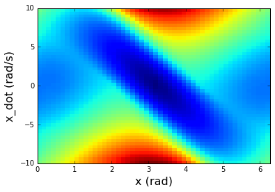
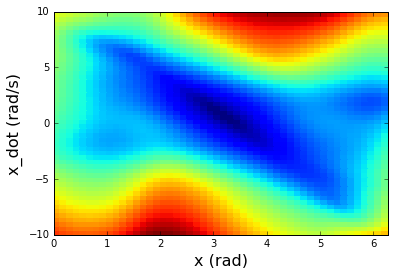

# ensemble_ioc
A module implementing ensemble inverse optimal control and relevant examples

## Dependencies:

Numpy           (>= 1.11.1)

Scikit-learn    (>= 0.18.0)

matplotlib      (>= 1.5.1)

[gmr repository](https://github.com/navigator8972/gmr.git)

## An interted pendulum example - target and learned cost-to-go

